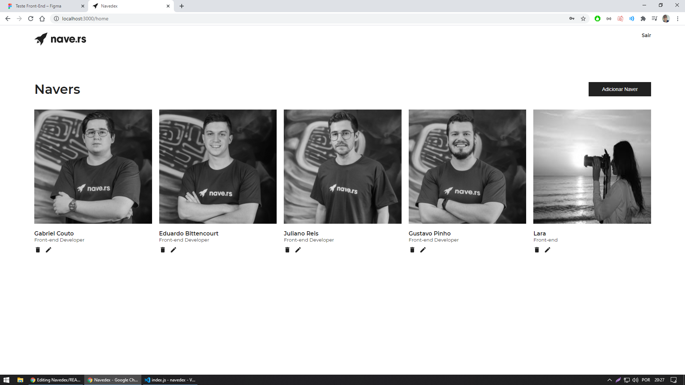

# Índice

- [Sobre](#sobre)
- [Tecnologias Utilizadas](#tecnologias-utilizadas)
- [Como Usar](#como-usar)
- [Como Contribuir](#como-contribuir)

<a id="sobre"></a>

## :bookmark: Sobre

O <strong>Navedex</strong> é uma aplicação Web para visualização e criação dos navers, possuindo informações como: nomes, idades, cargos, tempo de empresa e projetos que participou..


<a id="tecnologias-utilizadas"></a>

## :rocket: Tecnologias Utilizadas

O projeto foi desenvolvido utilizando as seguintes tecnologias

- [ReactJS](https://reactjs.org/)
- [NaversApi](https://www.getpostman.com/collections/e6afe4028c2a1e56e577)
- [React Router](https://reacttraining.com/react-router/web/guides/quick-start)
- [Unform](https://github.com/Rocketseat/unform)
- [yup](https://github.com/jquense/yup)
- [Axios](https://github.com/axios/axios)

## :heavy_check_mark: Resultado:

<h1 align="center">
    
</h1>

<a id="como-usar"></a>

## :fire: Como usar

- ### **Pré-requisitos**

  - É **preciso** ter um gerenciador de pacotes seja o **[NPM](https://www.npmjs.com/)** ou **[Yarn](https://yarnpkg.com/)**.

1. Faça um clone :

```sh
  $ git clone https://github.com/williamroberttv/navedex.git
```

2. Executando a Aplicação:

```sh
  # Instale as dependências
  $ yarn
  $ npm install

  # Inicie a aplicação
  $ yarn start
  $ npm start
  
  # Faça Login
  email : william@email.com
  senha : teste123
  

```

<a id="como-contribuir"></a>

## :recycle: Como contribuir

- Faça um Fork desse repositório,
- Crie uma branch com a sua feature: `git checkout -b my-feature`
- Commit suas mudanças: `git commit -m 'feat: My new feature'`
- Push a sua branch: `git push origin my-feature
